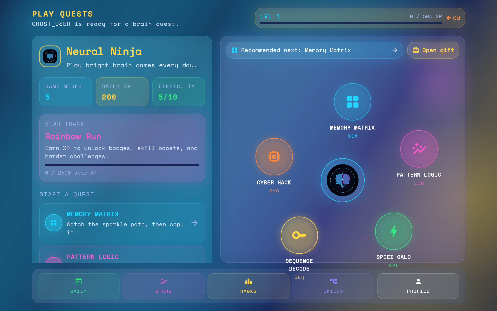

# Neural Ninja

A brain training game built with Flutter and deployed as a web application.

## 🎮 Play the Game

Visit the live website: [https://innnervision.github.io/Neural-Ninja/](https://innnervision.github.io/Neural-Ninja/)

## 📸 Screenshots

### Splash Screen

### Neural Map

### Memory Matrix

### Speed Calculation

### Skill Tree

### Analytics

### Profile

## 🚀 Features

- Memory training exercises
- Speed calculation challenges
- Skill progression system
- Performance analytics
- Personalized training plans
- Brain fitness tracking

## 🛠️ Tech Stack

- Flutter
- Dart
- Firebase (for backend services)

## 📝 License

This project is open source and available under the MIT License.
